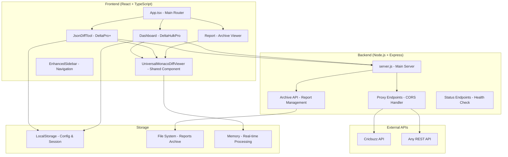
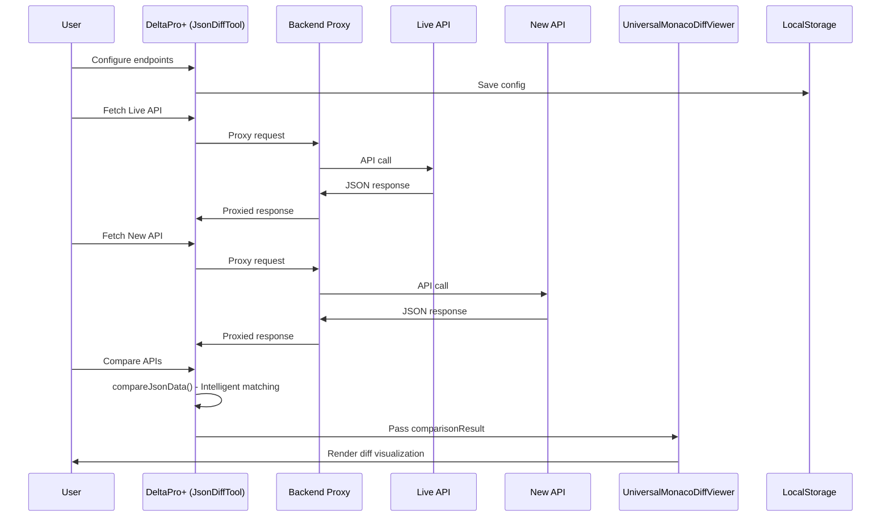
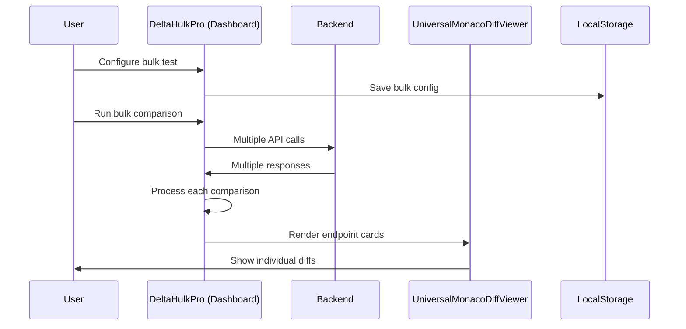

# CBZ API Delta - Complete Architecture Documentation

## 🏗️ Project Overview

**CBZ API Delta** is a professional, enterprise-grade API comparison and analysis platform designed for developers, QA engineers, and DevOps teams. It provides advanced semantic JSON comparison capabilities with world-class diff visualization and intelligent order-insensitive matching.

### 🎯 Core Products

1. **DeltaPro+** - Advanced JSON API comparison tool with semantic analysis
2. **DeltaHulkPro** - Bulk API comparison dashboard for multiple endpoints
3. **Archive System** - Historical report storage and analysis
4. **Universal Diff Engine** - Shared comparison logic across all tools

---

## 🏛️ High-Level Architecture (HLD)



---

## 🔧 Low-Level Design (LLD)

### Frontend Architecture

```
apps/frontend/src/
├── App.tsx                     # Main application router and layout
├── main.tsx                    # React entry point
├── components/
│   ├── ui/                     # shadcn/ui components (reusable)
│   ├── shared/                 # Shared business components
│   │   └── UniversalMonacoDiffViewer.tsx  # Core diff engine UI
│   ├── tools/                  # Legacy components (being phased out)
│   │   └── JsonDiffViewer.tsx  # Original DeltaPro+ viewer
│   └── layout/
│       └── EnhancedSidebar.tsx # Navigation and user management
├── pages/
│   ├── Dashboard.tsx           # DeltaHulkPro main interface
│   ├── JsonDiffTool.tsx        # DeltaPro+ main interface
│   └── Report.tsx              # Archive report viewer
├── hooks/
│   └── use-toast.tsx           # Toast notification system
├── contexts/
│   └── ThemeContext.tsx        # Dark/light mode management
├── services/
│   └── api.ts                  # Backend API communication
└── types/
    └── index.ts                # TypeScript type definitions
```

### Backend Architecture

```
apps/backend/src/
├── server.js                   # Express server with all endpoints
├── routes/                     # API route handlers (planned)
├── middleware/                 # CORS, auth, logging (planned)
└── utils/                      # Helper functions (planned)
```

---

## 🔄 Data Flow Diagrams

### DeltaPro+ Comparison Flow



### DeltaHulkPro Bulk Comparison Flow



---

## 📁 File Roles and Responsibilities

### Core Application Files

| File | Role | Responsibilities | Dependencies |
|------|------|------------------|--------------|
| `App.tsx` | Main Router | Route management, layout, theme provider | React Router, ThemeContext |
| `main.tsx` | Entry Point | React DOM rendering, global styles | React, CSS imports |

### Pages (Main Features)

| File | Role | Responsibilities | Key Features |
|------|------|------------------|--------------|
| `JsonDiffTool.tsx` | DeltaPro+ | Single API comparison, intelligent diff logic | Order-insensitive comparison, FTUE, config persistence |
| `Dashboard.tsx` | DeltaHulkPro | Bulk API comparison dashboard | Multi-endpoint testing, report generation |
| `Report.tsx` | Archive Viewer | Historical report analysis | Archive browsing, report rendering |

### Shared Components

| File | Role | Responsibilities | Used By |
|------|------|------------------|---------|
| `UniversalMonacoDiffViewer.tsx` | Core Diff Engine | Monaco editor, diff visualization, summary | DeltaPro+, DeltaHulkPro, Archive |
| `EnhancedSidebar.tsx` | Navigation | Route navigation, user session, dark mode | All pages |

### Legacy Components (Being Phased Out)

| File | Status | Replacement | Notes |
|------|--------|-------------|-------|
| `JsonDiffViewer.tsx` | Legacy | UniversalMonacoDiffViewer | Original DeltaPro+ viewer, contains reference logic |

---

## 🔧 Tech Stack Analysis

### Frontend Stack
- **React 18** - UI framework
- **TypeScript** - Type safety
- **Vite** - Build tool and dev server
- **Tailwind CSS** - Styling framework
- **shadcn/ui** - Component library
- **Monaco Editor** - Code diff visualization
- **Framer Motion** - Animations
- **React Router** - Client-side routing
- **Lucide Icons** - Icon library

### Backend Stack
- **Node.js** - Runtime
- **Express.js** - Web framework
- **CORS** - Cross-origin handling
- **File System** - Report storage

### Development Tools
- **pnpm** - Package manager
- **ESLint** - Code linting
- **Docker** - Containerization
- **Nginx** - Reverse proxy

---

## 🔐 Session and Storage Management

### LocalStorage Usage

| Key | Purpose | Data Structure | Persistence |
|-----|---------|----------------|-------------|
| `deltapro-config` | DeltaPro+ endpoint configurations | `{left: EndpointConfig, right: EndpointConfig}` | Session-based |
| `deltahulk-config` | DeltaHulkPro bulk test configurations | `{endpoints: EndpointConfig[], platforms: string[]}` | Session-based |
| `theme-preference` | Dark/light mode setting | `"dark" \| "light"` | Permanent |
| `sidebar-collapsed` | Sidebar state | `boolean` | Session-based |

### Session Management
- **No server-side sessions** - Stateless architecture
- **Client-side state** - React state + LocalStorage
- **Configuration persistence** - Auto-save on change
- **Security** - No sensitive data stored, in-memory processing only

---

## 🌐 API Integration

### External APIs Used

| API | Purpose | Usage Pattern | Error Handling |
|-----|---------|---------------|----------------|
| Cricbuzz API | Example/testing | `https://apiserver.cricbuzz.com/w/home/v1/matches` | Proxy through backend |
| Generic REST APIs | User-defined endpoints | Any valid JSON API | CORS proxy, timeout handling |

### Backend Proxy Endpoints

| Endpoint | Method | Purpose | Request Format |
|----------|--------|---------|----------------|
| `/api/proxy` | POST | CORS proxy for external APIs | `{url, method, headers, body}` |
| `/api/status` | GET | Health check | None |
| `/api/run-test` | POST | Trigger bulk test | Test configuration |
| `/api/archived-reports` | GET | List archived reports | None |
| `/api/archived-reports/:folder` | GET | Get specific report | Folder name |

---

## 🏢 Product Features Analysis

### DeltaPro+ Features

| Feature | Implementation | Status | Technical Details |
|---------|----------------|--------|-------------------|
| **Intelligent Comparison** | `compareJsonData()` in JsonDiffTool | ✅ Active | Order-insensitive, semantic matching |
| **Monaco Diff Viewer** | UniversalMonacoDiffViewer | ✅ Active | Side-by-side, syntax highlighting |
| **Visual Diff Tree** | Expandable diff items | ✅ Active | Severity-based color coding |
| **Advanced Summary** | Statistics cards | ✅ Active | Critical/High/Medium/Low breakdown |
| **Order Sensitivity Toggle** | State-based switching | ✅ Active | Positional vs semantic comparison |
| **Config Persistence** | LocalStorage auto-save | ✅ Active | Endpoint configurations saved |
| **Professional FTUE** | Guided workflow | ✅ Active | Live API vs New API labeling |

### DeltaHulkPro Features

| Feature | Implementation | Status | Technical Details |
|---------|----------------|--------|-------------------|
| **Bulk Comparison** | Multi-endpoint processing | ✅ Active | Parallel API calls |
| **Endpoint Cards** | UniversalMonacoDiffViewer in modal | ✅ Active | Reuses DeltaPro+ engine |
| **Platform/Geo Support** | Configuration options | ✅ Active | Multi-environment testing |
| **Report Generation** | JSON export | ✅ Active | Structured report format |
| **Dashboard UI** | Real-time status | ✅ Active | Run button, activity indicators |

---

## 🔄 Component Modularity Analysis

### Reusable Components ✅

| Component | Reused By | Modularity Score | Notes |
|-----------|-----------|------------------|-------|
| UniversalMonacoDiffViewer | DeltaPro+, DeltaHulkPro, Archive | 🟢 Excellent | Single source of truth |
| EnhancedSidebar | All pages | 🟢 Excellent | Centralized navigation |
| shadcn/ui components | All components | 🟢 Excellent | Consistent design system |

### Duplicate/Legacy Components ⚠️

| Component | Status | Duplication Issue | Action Needed |
|-----------|--------|-------------------|---------------|
| JsonDiffViewer | Legacy | Contains reference logic | Extract algorithm, deprecate UI |
| Monaco Editor instances | Multiple | Different configurations | Standardize through Universal component |

---

## 🔍 Critical Architecture Issues Identified

### 1. Comparison Logic Confusion
- **Issue**: Multiple comparison implementations
- **Files Affected**: JsonDiffTool.tsx, JsonDiffViewer.tsx, UniversalMonacoDiffViewer.tsx
- **Impact**: Inconsistent results, maintenance complexity
- **Solution**: Unify around single algorithm in JsonDiffTool.tsx

### 2. Order-Insensitive Logic Not Working
- **Issue**: Still showing positional comparison results
- **Root Cause**: Algorithm implementation or data flow issue
- **Evidence**: `matchId: 119573 vs 120713` flagged as "changed" instead of "different items"
- **Solution**: Debug and fix semantic matching algorithm

### 3. Backend-Frontend Duplication
- **Issue**: Both doing API calls and processing
- **Impact**: Unnecessary complexity
- **Solution**: Clarify responsibilities - Backend for CORS, Frontend for logic

---

## 📊 Performance and Scalability

### Current Performance Characteristics
- **Frontend Bundle Size**: ~661KB (needs optimization)
- **Memory Usage**: In-memory processing only
- **API Response Time**: Depends on external APIs
- **Diff Processing**: Client-side, real-time

### Scalability Considerations
- **Large JSON Handling**: Monaco Editor limitations
- **Bulk Comparison**: Limited by browser memory
- **Archive Storage**: File system based, needs database for scale
- **Concurrent Users**: Stateless, horizontally scalable

---

## 🔮 Future Architecture Roadmap

### Phase 1: Stabilization
1. Fix order-insensitive comparison logic
2. Unify diff engine across all components
3. Complete documentation
4. Add comprehensive testing

### Phase 2: Enhancement
1. Database integration for archives
2. User authentication and multi-tenancy
3. API rate limiting and caching
4. Advanced diff algorithms (AI-powered)

### Phase 3: Scale
1. Microservices architecture
2. Real-time collaboration
3. Plugin system for custom comparisons
4. Enterprise features (SSO, audit logs)

---

## 📝 Development Guidelines

### Code Organization Principles
1. **Single Responsibility** - Each component has one clear purpose
2. **DRY (Don't Repeat Yourself)** - Shared logic in UniversalMonacoDiffViewer
3. **Separation of Concerns** - UI, logic, and data clearly separated
4. **Type Safety** - Comprehensive TypeScript usage

### Naming Conventions
- **Components**: PascalCase (e.g., `UniversalMonacoDiffViewer`)
- **Files**: PascalCase for components, camelCase for utilities
- **Functions**: camelCase (e.g., `compareJsonData`)
- **Constants**: UPPER_SNAKE_CASE (e.g., `STORAGE_KEY`)

### Testing Strategy (Planned)
- **Unit Tests**: Component logic and utilities
- **Integration Tests**: API endpoints and data flow
- **E2E Tests**: Complete user workflows
- **Performance Tests**: Large JSON handling

---

*This documentation is a living document and should be updated as the architecture evolves.*
