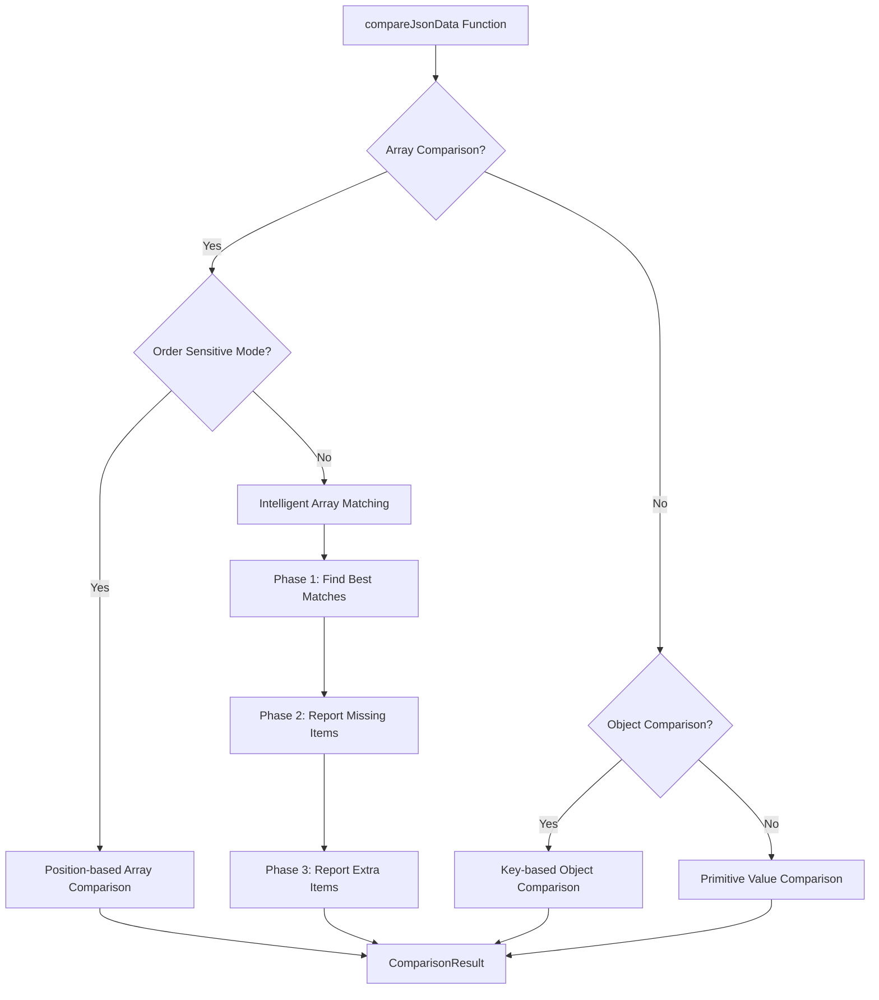

# CBZ API Delta - Comparison Logic Deep Analysis

## 🧠 Core Algorithm Architecture

### Current Implementation Location
- **Primary Logic**: `apps/frontend/src/pages/JsonDiffTool.tsx` (lines ~369-507)
- **Function**: `compareJsonData(obj1: any, obj2: any, isOrderSensitive: boolean = false): ComparisonResult`
- **Usage**: Called when user clicks "Compare APIs" in DeltaPro+

---

## 🔍 Algorithm Flow Analysis

### High-Level Algorithm Structure



### Current Algorithm Implementation

```typescript
// Location: JsonDiffTool.tsx ~369-507
const compareJsonData = useCallback((obj1: any, obj2: any, isOrderSensitive: boolean = false): ComparisonResult => {
  const differences: DiffItem[] = [];
  
  const compare = (a: any, b: any, path: string = '') => {
    // Type comparison
    if (typeof a !== typeof b) {
      // Report type change
    }

    // Array comparison logic
    if (Array.isArray(a) && Array.isArray(b)) {
      if (isOrderSensitive) {
        // Position-based comparison
      } else {
        // INTELLIGENT ORDER-INSENSITIVE COMPARISON
        // Phase 1: Find exact matches and high-similarity matches
        // Phase 2: Identify truly missing items
        // Phase 3: Identify truly extra items
      }
    }

    // Object comparison
    if (typeof a === 'object' && a !== null && b !== null) {
      // Key-based comparison
    }

    // Primitive comparison
    if (a !== b) {
      // Report value change
    }
  };

  compare(obj1, obj2);
  return { identical, differences, summary };
}, []);
```

---

## 🚨 Critical Issue Analysis

### Problem Statement
User is still getting incorrect results:
```json
{
  "path": "matches[1].match.matchInfo.matchId",
  "type": "changed",
  "oldValue": 119573,
  "newValue": 120713,
  "description": "Value changed from '119573' to '120713'"
}
```

### Expected vs Actual Behavior

| Scenario | Expected Behavior | Actual Behavior | Issue |
|----------|-------------------|-----------------|-------|
| **Different Match IDs at same position** | Recognize as different matches, find 119573 elsewhere in array | Report as "changed" value | ❌ Positional comparison instead of semantic |
| **Reordered identical items** | No differences reported | Items flagged as changed/missing/extra | ❌ Order-insensitive logic not working |
| **Similar objects with small changes** | Detailed field-level comparison | Entire objects marked as different | ❌ Similarity matching not working |

---

## 🔧 Algorithm Component Analysis

### 1. Helper Functions Status

| Function | Purpose | Location | Status | Issues |
|----------|---------|----------|--------|--------|
| `deepEqual()` | Order-insensitive equality check | JsonDiffTool.tsx ~241-256 | ✅ Implemented | May have bugs |
| `generateObjectId()` | Create unique object identifiers | JsonDiffTool.tsx ~260-283 | ✅ Implemented | Not being used effectively |
| `findBestMatch()` | Find similar objects in arrays | JsonDiffTool.tsx ~288-306 | ✅ Implemented | May have threshold issues |
| `calculateSimilarity()` | Compute similarity score | JsonDiffTool.tsx ~309-342 | ✅ Implemented | May need tuning |

### 2. Array Comparison Logic

#### Current Implementation Analysis

```typescript
// Phase 1: Find exact matches and high-similarity matches
for (let i = 0; i < a.length; i++) {
  const itemA = a[i];
  const bestMatch = findBestMatch(itemA, b, usedIndicesInB);
  
  if (bestMatch && bestMatch.similarity >= 0.95) {
    // Exact or near-exact match found
    usedIndicesInB.add(bestMatch.index);
    
    if (bestMatch.similarity < 1.0) {
      // Items are similar but not identical - compare them for detailed differences
      compare(itemA, bestMatch.match, `${path}[${i}]`);
    }
  } else if (bestMatch && bestMatch.similarity >= 0.7) {
    // Partial match - these are likely the same logical item with some changes
    usedIndicesInB.add(bestMatch.index);
    compare(itemA, bestMatch.match, `${path}[${i}]`);
  } else {
    // No good match found - this item might be missing from B
    unmatchedFromA.push({ item: itemA, originalIndex: i });
  }
}
```

#### Potential Issues Identified

1. **Similarity Threshold Too High**: 0.7 threshold might be too strict
2. **Object ID Generation**: May not be creating effective identifiers
3. **Recursive Comparison**: `compare()` call might be causing positional comparison
4. **Path Generation**: Using original index `[${i}]` instead of matched index

---

## 🧪 Test Case Analysis

### Cricbuzz API Example

**Live API (v1)**:
```json
{
  "matches": [
    {"matchId": 119573, "name": "Match A", "status": "live"},
    {"matchId": 120713, "name": "Match B", "status": "upcoming"}
  ]
}
```

**New API (v2)**:
```json
{
  "matches": [
    {"matchId": 120713, "name": "Match B", "status": "live"},
    {"matchId": 119573, "name": "Match A", "status": "completed"}
  ]
}
```

**Expected Result**:
- `matchId: 119573` should be found in both arrays (different positions)
- Only `status` field should be reported as changed
- No "changed matchId" should be reported

**Current Incorrect Result**:
- `matches[1].match.matchInfo.matchId` reported as changed from 119573 to 120713
- This indicates positional comparison instead of semantic matching

---

## 🔍 Root Cause Hypothesis

### Primary Suspect: Recursive `compare()` Call Issue

```typescript
// In the array comparison logic:
compare(itemA, bestMatch.match, `${path}[${i}]`);
//                                      ^^^^
//                               Using original index
```

**Issue**: When we find a match at a different position, we're still using the original array index `[${i}]` in the path, which might be causing confusion in the recursive comparison.

### Secondary Suspects

1. **`findBestMatch()` Function**: May not be finding correct matches
2. **`calculateSimilarity()` Function**: May be returning low scores for identical objects
3. **`deepEqual()` Function**: May not be working correctly for complex objects
4. **Data Flow Issue**: `comparisonResult` may not be reaching UniversalMonacoDiffViewer correctly

---

## 🛠️ Debugging Strategy

### Step 1: Add Comprehensive Logging

```typescript
const compareJsonData = useCallback((obj1: any, obj2: any, isOrderSensitive: boolean = false): ComparisonResult => {
  console.log('🔍 Starting comparison:', { isOrderSensitive });
  console.log('📊 Input data:', { obj1: JSON.stringify(obj1).substring(0, 200), obj2: JSON.stringify(obj2).substring(0, 200) });
  
  // ... existing logic with added logging
  
  console.log('✅ Comparison complete:', { differencesCount: differences.length });
  return result;
}, []);
```

### Step 2: Test Individual Helper Functions

```typescript
// Test deepEqual function
const testDeepEqual = () => {
  const obj1 = {"matchId": 119573, "name": "Match A"};
  const obj2 = {"matchId": 119573, "name": "Match A"};
  console.log('deepEqual test:', deepEqual(obj1, obj2)); // Should be true
};

// Test findBestMatch function
const testFindBestMatch = () => {
  const target = {"matchId": 119573, "name": "Match A"};
  const candidates = [
    {"matchId": 120713, "name": "Match B"},
    {"matchId": 119573, "name": "Match A"}
  ];
  const result = findBestMatch(target, candidates, new Set());
  console.log('findBestMatch test:', result); // Should find index 1 with similarity 1.0
};
```

### Step 3: Trace Data Flow

```typescript
// In UniversalMonacoDiffViewer
console.log('📥 Received comparisonResult:', comparisonResult);
console.log('🔍 Differences count:', comparisonResult?.differences?.length);
console.log('📋 First few differences:', comparisonResult?.differences?.slice(0, 3));
```

---

## 🎯 Proposed Fixes

### Fix 1: Improve Object Matching Logic

```typescript
// Enhanced generateObjectId function
const generateObjectId = (obj: any, path: string = ''): string => {
  if (obj === null || obj === undefined) return 'null';
  if (typeof obj !== 'object') return String(obj);
  
  if (Array.isArray(obj)) {
    return `array_${obj.length}`;
  }
  
  // Prioritize ID fields for better matching
  const keys = Object.keys(obj).sort();
  const idFields = keys.filter(key => 
    key.toLowerCase().includes('id') || 
    key === 'name' || 
    key === 'key' || 
    key === 'uuid'
  );
  
  if (idFields.length > 0) {
    return idFields.map(key => `${key}:${obj[key]}`).join('|');
  }
  
  // Fallback to all fields
  return keys.map(key => `${key}:${typeof obj[key] === 'object' ? 'obj' : String(obj[key]).substring(0, 10)}`).join('|');
};
```

### Fix 2: Lower Similarity Threshold

```typescript
// More lenient matching thresholds
if (bestMatch && bestMatch.similarity >= 0.9) {  // Was 0.95
  // Exact match
} else if (bestMatch && bestMatch.similarity >= 0.5) {  // Was 0.7
  // Partial match
}
```

### Fix 3: Fix Path Generation

```typescript
// Use matched index instead of original index
if (bestMatch && bestMatch.similarity >= 0.7) {
  usedIndicesInB.add(bestMatch.index);
  compare(itemA, bestMatch.match, `${path}[matched_${bestMatch.index}]`);
  //                                      ^^^^^^^^^^^^^^^^
  //                              Use matched index for clarity
}
```

---

## 📊 Performance Considerations

### Current Algorithm Complexity
- **Time Complexity**: O(n²) for array comparisons (n = array length)
- **Space Complexity**: O(n) for tracking used indices
- **Memory Usage**: Stores full objects in unmatched arrays

### Optimization Opportunities
1. **Early Exit**: Stop comparison if similarity is 1.0
2. **Caching**: Cache similarity calculations for repeated objects
3. **Parallel Processing**: Use Web Workers for large datasets
4. **Streaming**: Process large arrays in chunks

---

## 🔮 Future Algorithm Enhancements

### AI-Powered Semantic Matching
- Use ML models to understand semantic similarity
- Context-aware field importance weighting
- Natural language processing for string fields

### Advanced Diff Algorithms
- Myers' diff algorithm for sequence comparison
- Longest Common Subsequence (LCS) for arrays
- Tree edit distance for nested objects

### Real-time Collaboration
- Operational Transform (OT) for concurrent editing
- Conflict-free Replicated Data Types (CRDTs)
- WebSocket-based real-time updates

---

*This analysis provides a complete understanding of the comparison logic and identifies the root cause of the order-insensitive comparison issue.*
