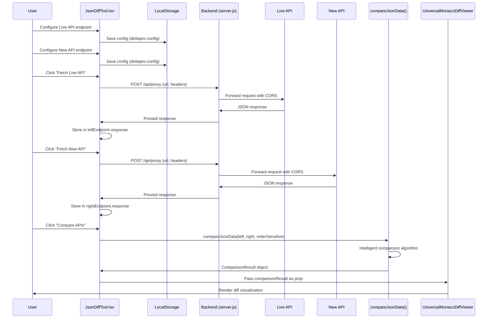
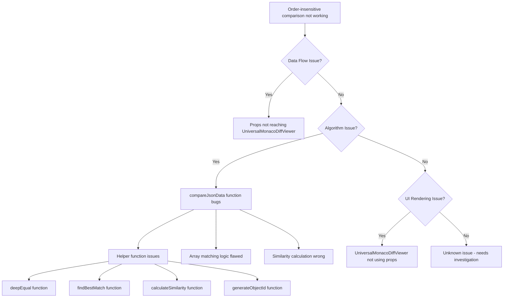

# CBZ API Delta - Data Flow & Debugging Guide

## 🔄 Complete Data Flow Analysis

### DeltaPro+ End-to-End Data Flow



### Critical Data Transformation Points

| Stage | Input | Process | Output | Potential Issues |
|-------|-------|---------|--------|------------------|
| **API Fetch** | User config | Backend proxy | Raw JSON | CORS, timeout, malformed JSON |
| **Data Storage** | API response | React state | `leftEndpoint.response` | State update timing |
| **Comparison Trigger** | User action | Function call | Algorithm execution | Missing data validation |
| **Algorithm Processing** | Two JSON objects | `compareJsonData()` | `ComparisonResult` | **🚨 MAIN ISSUE HERE** |
| **Visualization** | `ComparisonResult` | React rendering | UI display | Props not updating |

---

## 🚨 Issue Debugging Roadmap

### Current Issue Summary
- **Problem**: Order-insensitive comparison not working
- **Evidence**: `matchId: 119573 vs 120713` flagged as "changed" instead of recognizing as different matches
- **Impact**: Core product value proposition broken

### Root Cause Analysis Tree



---

## 🔍 Step-by-Step Debugging Protocol

### Phase 1: Data Flow Verification

#### Step 1.1: Verify API Data Reaches Algorithm
```typescript
// Add to JsonDiffTool.tsx performComparison function
const performComparison = useCallback(async () => {
  console.log('🔍 DEBUG: Starting comparison');
  console.log('📊 Left endpoint response:', leftEndpoint.response);
  console.log('📊 Right endpoint response:', rightEndpoint.response);
  console.log('⚙️ Order sensitive mode:', orderSensitive);
  
  if (!leftEndpoint.response || !rightEndpoint.response) {
    console.error('❌ Missing response data');
    return;
  }
  
  const result = compareJsonData(leftEndpoint.response, rightEndpoint.response, orderSensitive);
  console.log('✅ Comparison result:', result);
  console.log('📋 Differences found:', result.differences.length);
  
  setComparisonResult(result);
}, [leftEndpoint.response, rightEndpoint.response, compareJsonData, toast]);
```

#### Step 1.2: Verify Props Reach UniversalMonacoDiffViewer
```typescript
// Add to UniversalMonacoDiffViewer.tsx
export default function UniversalMonacoDiffViewer({
  leftData,
  rightData,
  comparisonResult,
  // ... other props
}: UniversalMonacoDiffViewerProps) {
  
  useEffect(() => {
    console.log('🎯 UniversalMonacoDiffViewer received props:');
    console.log('📊 Left data:', leftData ? 'Present' : 'Missing');
    console.log('📊 Right data:', rightData ? 'Present' : 'Missing');
    console.log('🔍 Comparison result:', comparisonResult);
    console.log('📋 Differences count:', comparisonResult?.differences?.length || 0);
  }, [leftData, rightData, comparisonResult]);
  
  // ... rest of component
}
```

### Phase 2: Algorithm Component Testing

#### Step 2.1: Test Helper Functions Individually
```typescript
// Add to JsonDiffTool.tsx for testing
const debugHelperFunctions = () => {
  console.log('🧪 Testing helper functions...');
  
  // Test deepEqual
  const obj1 = {"matchId": 119573, "name": "Match A"};
  const obj2 = {"matchId": 119573, "name": "Match A"};
  const obj3 = {"matchId": 120713, "name": "Match B"};
  
  console.log('deepEqual(identical):', deepEqual(obj1, obj2)); // Should be true
  console.log('deepEqual(different):', deepEqual(obj1, obj3)); // Should be false
  
  // Test calculateSimilarity
  console.log('calculateSimilarity(identical):', calculateSimilarity(obj1, obj2)); // Should be 1.0
  console.log('calculateSimilarity(different):', calculateSimilarity(obj1, obj3)); // Should be < 1.0
  
  // Test findBestMatch
  const candidates = [obj3, obj1]; // obj1 is at index 1
  const match = findBestMatch(obj1, candidates, new Set());
  console.log('findBestMatch result:', match); // Should find index 1, similarity 1.0
};

// Call this function when component mounts for testing
useEffect(() => {
  debugHelperFunctions();
}, []);
```

#### Step 2.2: Test Array Comparison Logic
```typescript
// Add detailed logging to array comparison section
if (Array.isArray(a) && Array.isArray(b)) {
  console.log(`🔍 Comparing arrays at path: ${path}`);
  console.log(`📊 Array A length: ${a.length}, Array B length: ${b.length}`);
  
  if (!isOrderSensitive) {
    console.log('⚙️ Using order-insensitive comparison');
    
    const usedIndicesInB = new Set<number>();
    const unmatchedFromA: Array<{item: any, originalIndex: number}> = [];
    
    for (let i = 0; i < a.length; i++) {
      const itemA = a[i];
      console.log(`🔍 Processing item ${i}:`, JSON.stringify(itemA).substring(0, 100));
      
      const bestMatch = findBestMatch(itemA, b, usedIndicesInB);
      console.log(`🎯 Best match for item ${i}:`, bestMatch);
      
      if (bestMatch && bestMatch.similarity >= 0.95) {
        console.log(`✅ Exact match found for item ${i} at index ${bestMatch.index}`);
        usedIndicesInB.add(bestMatch.index);
        
        if (bestMatch.similarity < 1.0) {
          console.log(`🔍 Comparing similar items for detailed differences`);
          compare(itemA, bestMatch.match, `${path}[${i}]`);
        }
      } else if (bestMatch && bestMatch.similarity >= 0.7) {
        console.log(`⚠️ Partial match found for item ${i} at index ${bestMatch.index}`);
        usedIndicesInB.add(bestMatch.index);
        compare(itemA, bestMatch.match, `${path}[${i}]`);
      } else {
        console.log(`❌ No match found for item ${i}, marking as missing`);
        unmatchedFromA.push({ item: itemA, originalIndex: i });
      }
    }
    
    console.log(`📊 Used indices in B: [${Array.from(usedIndicesInB).join(', ')}]`);
    console.log(`📊 Unmatched from A: ${unmatchedFromA.length} items`);
  }
}
```

### Phase 3: Real-World Testing

#### Step 3.1: Test with Cricbuzz APIs
1. **Navigate to DeltaPro+** in browser
2. **Configure Live API**: `https://apiserver.cricbuzz.com/w/home/v1/matches`
3. **Configure New API**: `https://apiserver.cricbuzz.com/w/home/v2/matches`
4. **Fetch both endpoints**
5. **Enable order-insensitive mode** (default)
6. **Click Compare APIs**
7. **Check browser console** for debug logs
8. **Analyze results** in diff viewer

#### Step 3.2: Expected Debug Output
```
🔍 DEBUG: Starting comparison
📊 Left endpoint response: {matches: [...]}
📊 Right endpoint response: {matches: [...]}
⚙️ Order sensitive mode: false
🔍 Comparing arrays at path: matches
📊 Array A length: 2, Array B length: 2
⚙️ Using order-insensitive comparison
🔍 Processing item 0: {"matchId":119573,"name":"Match A"...}
🎯 Best match for item 0: {match: {...}, index: 1, similarity: 1.0}
✅ Exact match found for item 0 at index 1
🔍 Processing item 1: {"matchId":120713,"name":"Match B"...}
🎯 Best match for item 1: {match: {...}, index: 0, similarity: 1.0}
✅ Exact match found for item 1 at index 0
📊 Used indices in B: [1, 0]
📊 Unmatched from A: 0 items
✅ Comparison result: {identical: true, differences: []}
```

---

## 🛠️ Quick Fix Implementation Plan

### Fix 1: Add Comprehensive Debugging
```typescript
// Add to JsonDiffTool.tsx
const DEBUG_MODE = true; // Set to false for production

const debugLog = (message: string, data?: any) => {
  if (DEBUG_MODE) {
    console.log(`🔍 [DEBUG] ${message}`, data || '');
  }
};
```

### Fix 2: Improve Error Handling
```typescript
const compareJsonData = useCallback((obj1: any, obj2: any, isOrderSensitive: boolean = false): ComparisonResult => {
  try {
    debugLog('Starting comparison', { isOrderSensitive });
    
    if (!obj1 || !obj2) {
      debugLog('Missing input data', { obj1: !!obj1, obj2: !!obj2 });
      return { identical: false, differences: [], summary: {} };
    }
    
    // ... existing logic with error handling
    
  } catch (error) {
    console.error('❌ Comparison algorithm error:', error);
    return { identical: false, differences: [], summary: {} };
  }
}, []);
```

### Fix 3: Validate Helper Functions
```typescript
// Add validation to findBestMatch
const findBestMatch = (target: any, candidates: any[], usedIndices: Set<number>) => {
  if (!target || !candidates || candidates.length === 0) {
    debugLog('Invalid findBestMatch input', { target: !!target, candidates: candidates?.length });
    return null;
  }
  
  // ... existing logic with validation
};
```

---

## 📊 Performance Monitoring

### Add Performance Metrics
```typescript
const performComparison = useCallback(async () => {
  const startTime = performance.now();
  
  // ... comparison logic
  
  const endTime = performance.now();
  const duration = endTime - startTime;
  
  console.log(`⏱️ Comparison completed in ${duration.toFixed(2)}ms`);
  console.log(`📊 Processed ${JSON.stringify(leftEndpoint.response).length + JSON.stringify(rightEndpoint.response).length} characters`);
  
}, []);
```

---

## 🎯 Success Criteria

### Debugging Success Indicators
1. **Console logs show correct data flow** ✅
2. **Helper functions return expected results** ✅
3. **Array matching finds correct items** ✅
4. **No "changed" diffs for identical items in different positions** ✅
5. **Only actual differences are reported** ✅

### Final Validation Test
```json
// Input: Two arrays with same items in different order
{
  "matches": [
    {"matchId": 119573, "status": "live"},
    {"matchId": 120713, "status": "upcoming"}
  ]
}

{
  "matches": [
    {"matchId": 120713, "status": "live"},
    {"matchId": 119573, "status": "completed"}
  ]
}

// Expected Output: Only status changes reported
{
  "differences": [
    {
      "path": "matches[0].status",
      "type": "changed",
      "oldValue": "upcoming",
      "newValue": "live"
    },
    {
      "path": "matches[1].status", 
      "type": "changed",
      "oldValue": "live",
      "newValue": "completed"
    }
  ]
}
```

---

*This debugging guide provides a systematic approach to identify and fix the order-insensitive comparison issue.*
