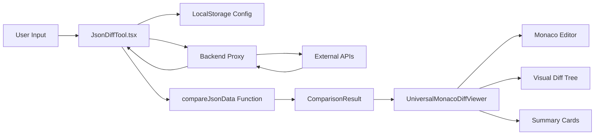
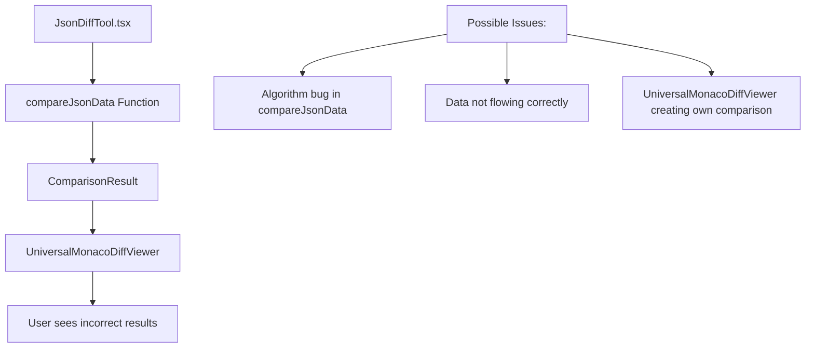
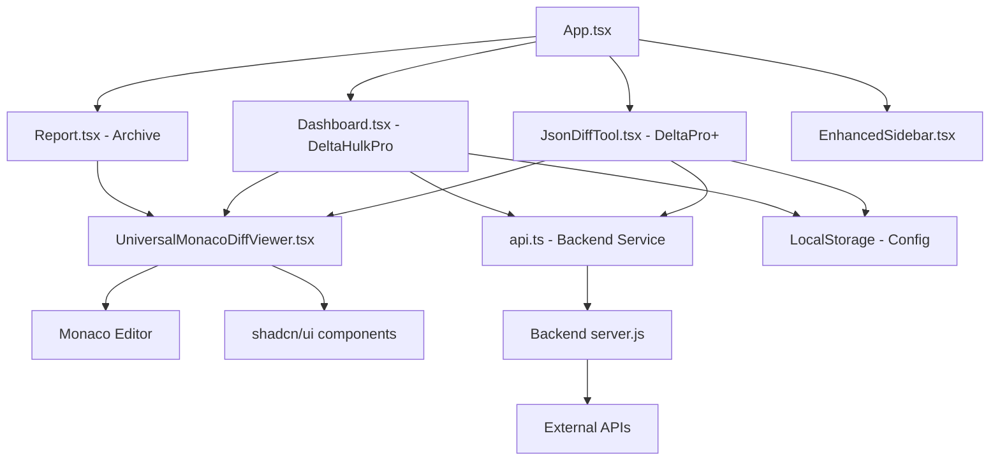

# CBZ API Delta - Complete File Mapping & Responsibilities

## 📁 Project Structure Deep Dive

### Root Level Files

```
cbz-api-delta-new/
├── .git/                       # Git version control
├── .gitignore                  # Git ignore patterns
├── README.md                   # Project overview (needs update)
├── pnpm-workspace.yaml         # PNPM monorepo configuration
├── pnpm-lock.yaml             # Dependency lock file
├── node_modules/              # Root dependencies
├── docs/                      # 📚 Documentation (NEW)
│   ├── ARCHITECTURE.md        # Complete architecture overview
│   ├── FILE_MAPPING.md        # This file - detailed file roles
│   ├── DATA_FLOW.md           # Data flow diagrams and analysis
│   └── COMPARISON_LOGIC.md    # Diff algorithm documentation
├── apps/                      # 🏗️ Application modules
├── packages/                  # 📦 Shared packages (if any)
└── config/                    # ⚙️ Configuration files
```

---

## 🖥️ Frontend Application (`apps/frontend/`)

### Entry Point & Core Files

| File | Role | Key Responsibilities | Dependencies | Size/Complexity |
|------|------|---------------------|--------------|-----------------|
| `src/main.tsx` | **React Entry Point** | DOM rendering, global CSS imports | React 18, CSS | 🟢 Simple |
| `src/App.tsx` | **Main Application Router** | Route definitions, theme provider, layout | React Router, ThemeContext | 🟡 Medium |
| `src/App.css` | **Global Styles** | Application-wide styling | Tailwind base | 🟢 Simple |
| `src/global.css` | **Tailwind Configuration** | CSS variables, dark mode, component styles | Tailwind CSS | 🟢 Simple |
| `src/index.css` | **Base Styles** | HTML/body base styles | None | 🟢 Simple |
| `src/vite-env.d.ts` | **Vite Types** | TypeScript environment definitions | Vite | 🟢 Simple |

### Pages (Main Features)

| File | Product | Role | Key Features | Dependencies | Complexity |
|------|---------|------|--------------|--------------|------------|
| `src/pages/JsonDiffTool.tsx` | **DeltaPro+** | Single API comparison interface | - Intelligent comparison algorithm<br>- Order-sensitive toggle<br>- Professional FTUE<br>- Config persistence<br>- Real-time diff analysis | UniversalMonacoDiffViewer, API service | 🔴 Complex |
| `src/pages/Dashboard.tsx` | **DeltaHulkPro** | Bulk API comparison dashboard | - Multi-endpoint configuration<br>- Parallel API testing<br>- Report generation<br>- Platform/geo support | UniversalMonacoDiffViewer, Backend API | 🟡 Medium |
| `src/pages/Report.tsx` | **Archive System** | Historical report viewer | - Archive browsing<br>- Report rendering<br>- Legacy report support | UniversalMonacoDiffViewer, Archive API | 🟡 Medium |

### Shared Components (`src/components/shared/`)

| File | Role | Used By | Key Features | Status |
|------|------|---------|--------------|--------|
| `UniversalMonacoDiffViewer.tsx` | **Core Diff Engine UI** | DeltaPro+, DeltaHulkPro, Archive | - Monaco diff editor<br>- Visual diff tree<br>- Advanced summary<br>- Modal support<br>- Copy/download features | ✅ Active |

### Layout Components (`src/components/layout/`)

| File | Role | Used By | Key Features | Status |
|------|------|---------|--------------|--------|
| `EnhancedSidebar.tsx` | **Navigation & User Management** | All pages | - Route navigation<br>- Dark mode toggle<br>- User session<br>- Responsive design | ✅ Active |

### Legacy Components (`src/components/tools/`)

| File | Status | Original Purpose | Current Role | Action Needed |
|------|--------|------------------|--------------|---------------|
| `JsonDiffViewer.tsx` | 🟠 Legacy | Original DeltaPro+ viewer | Reference implementation | Extract algorithm, deprecate UI |

### UI Components (`src/components/ui/`)

**shadcn/ui Component Library** - Industry-standard, reusable components:

| Component | Purpose | Usage Frequency | Customization |
|-----------|---------|-----------------|---------------|
| `card.tsx` | Content containers | 🔥 High | Gradient variants |
| `button.tsx` | Interactive elements | 🔥 High | Custom variants |
| `badge.tsx` | Status indicators | 🔥 High | Severity colors |
| `tabs.tsx` | Content organization | 🔥 High | Diff viewer tabs |
| `dialog.tsx` | Modal dialogs | 🟡 Medium | Endpoint cards |
| `separator.tsx` | Visual dividers | 🟡 Medium | Layout spacing |
| `toast.tsx` | Notifications | 🟡 Medium | Success/error feedback |

### Hooks (`src/hooks/`)

| File | Purpose | Used By | Key Features |
|------|---------|---------|--------------|
| `use-toast.tsx` | **Notification System** | All components | Toast notifications, success/error handling |

### Contexts (`src/contexts/`)

| File | Purpose | Provides | Used By |
|------|---------|----------|---------|
| `ThemeContext.tsx` | **Theme Management** | Dark/light mode state | App.tsx, all components |

### Services (`src/services/`)

| File | Purpose | Key Functions | Used By |
|------|---------|---------------|---------|
| `api.ts` | **Backend Communication** | API calls, CORS proxy, error handling | DeltaPro+, DeltaHulkPro |

### Types (`src/types/`)

| File | Purpose | Key Types | Used By |
|------|---------|-----------|---------|
| `index.ts` | **TypeScript Definitions** | ComparisonResult, DiffItem, EndpointConfig | All components |

---

## 🖥️ Backend Application (`apps/backend/`)

### Core Server Files

| File | Role | Key Responsibilities | Endpoints | Complexity |
|------|------|---------------------|-----------|------------|
| `src/server.js` | **Main Express Server** | - CORS proxy<br>- Archive API<br>- Health checks<br>- Static file serving | `/api/proxy`<br>`/api/status`<br>`/api/run-test`<br>`/api/archived-reports` | 🟡 Medium |

### Backend Architecture Analysis

```javascript
// Current server.js structure:
app.use(cors())                    // CORS middleware
app.use(express.json())            // JSON parsing
app.use(express.static())          // Static files

// API Endpoints:
POST /api/proxy                    // External API CORS proxy
GET  /api/status                   // Health check
POST /api/run-test                 // Bulk test trigger
GET  /api/archived-reports         // List archives
GET  /api/archived-reports/:folder // Get specific archive
```

---

## 🔄 Data Flow Analysis

### DeltaPro+ Data Flow



### Critical Data Structures

```typescript
// Core comparison types
interface ComparisonResult {
  identical: boolean;
  differences: DiffItem[];
  summary: {
    totalFields: number;
    identicalFields: number;
    differentFields: number;
    missingFields: number;
    extraFields: number;
    criticalDiffs: number;
    highDiffs: number;
    mediumDiffs: number;
    lowDiffs: number;
  };
}

interface DiffItem {
  path: string;
  type: 'missing' | 'extra' | 'changed' | 'type-changed';
  severity: 'low' | 'medium' | 'high' | 'critical';
  oldValue?: any;
  newValue?: any;
  description: string;
}
```

---

## 🔍 Critical Issues Identified

### 1. Comparison Logic Location Confusion

| File | Contains Logic | Status | Issue |
|------|----------------|--------|-------|
| `JsonDiffTool.tsx` | ✅ `compareJsonData()` | Active | Recently updated with intelligent logic |
| `JsonDiffViewer.tsx` | ❓ Unknown | Legacy | May contain reference implementation |
| `UniversalMonacoDiffViewer.tsx` | ❌ No comparison | Active | Only renders passed `comparisonResult` |

**Root Cause**: The comparison logic is correctly in `JsonDiffTool.tsx`, but the algorithm may have bugs or the data flow may be incorrect.

### 2. Order-Insensitive Algorithm Issue

**Current Problem**: 
```json
{
  "path": "matches[1].match.matchInfo.matchId",
  "type": "changed",
  "oldValue": 119573,
  "newValue": 120713,
  "description": "Value changed from '119573' to '120713'"
}
```

**Expected Behavior**: These should be recognized as different matches, not a "changed" value.

**Algorithm Location**: `JsonDiffTool.tsx` lines ~369-507 (`compareJsonData` function)

### 3. Potential Data Flow Issues



---

## 📊 Component Dependency Graph



---

## 🔧 Technical Debt Analysis

### High Priority Issues

| Issue | Impact | Files Affected | Effort |
|-------|--------|----------------|--------|
| **Order-insensitive comparison not working** | 🔴 Critical | JsonDiffTool.tsx | High |
| **Legacy JsonDiffViewer cleanup** | 🟡 Medium | JsonDiffViewer.tsx | Medium |
| **Bundle size optimization** | 🟡 Medium | All frontend | High |

### Medium Priority Issues

| Issue | Impact | Files Affected | Effort |
|-------|--------|----------------|--------|
| **Backend structure improvement** | 🟡 Medium | server.js | Medium |
| **Type safety improvements** | 🟢 Low | Multiple | Medium |
| **Documentation updates** | 🟢 Low | README.md | Low |

---

## 🎯 Next Steps for Debugging

### 1. Immediate Actions
1. **Debug `compareJsonData` function** in `JsonDiffTool.tsx`
2. **Test with real Cricbuzz endpoints** to reproduce issue
3. **Add console logging** to trace data flow
4. **Verify UniversalMonacoDiffViewer** is using passed data correctly

### 2. Architecture Improvements
1. **Extract comparison logic** to separate utility
2. **Create comprehensive tests** for comparison algorithm
3. **Unify all diff logic** in single location
4. **Remove legacy components** after migration

### 3. Performance Optimizations
1. **Code splitting** for large components
2. **Monaco Editor optimization** for large JSONs
3. **Bundle analysis** and size reduction
4. **Memory usage optimization** for bulk comparisons

---

*This file mapping provides a complete understanding of every file's role and responsibility in the CBZ API Delta project.*
